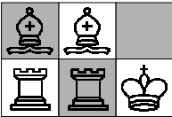

Chess-game
==========================

There are 2 rows and 3 column and 5 chess piece(1 King, 2 Bishops and 2 Rock) placed as in the picture

We can move with the pieces by the rules of chess, you can move only in the empty field. With rocks you can move only horizontally and vertically, with bishops you can move only diagonally and with king you can move all the 8 neighbor field if it is empty. The goal is to get  a given position as soon as possible. The image below is show how the goal state is looks like.

## Solution
    Bishop DiagonalRightDown
    Rock1 Up
    King DiagonalRightDown
    Rock1 Left
    Bishop DiagonalLeftUp
    King Right
    Bishop1 DiagonalLeftDown
    King Up
    Bishop DiagonalRightDown
    Rock1 Right
    Bishop1 DiagonalLeftUp
    Rock1 Down
    Bishop DiagonalLeftUp
    King Down

